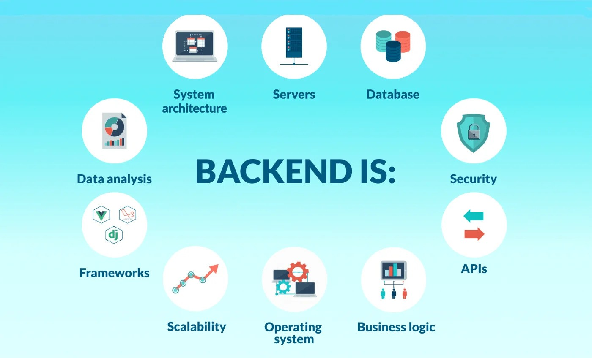

# Files from http-5125
## Back-End Web Development 1
## Course Code: HTTP 5125

### Academic Year: 2025-2026

In this course, students are introduced to server-side web development with the C# programming language, and will implement techniques for creating data-driven websites drawing from various external data sources.

# links
https://learn.microsoft.com/en-us/dotnet/csharp/

#Images

> **Note**: This repository contains essential files and resources to support your learning in back-end development. Familiarity with databases and APIs will enhance your understanding and implementation of data-driven techniques.

# Example codes

    [Route("api/[controller]")]
    [ApiController]
    public class J1Controller : ControllerBase
    {
        /// 

        /// Calculates total Score according to package delivered and collisions
        /// 

        /// <param name="collision">the number of collisions</param>
        /// <param name="delivered">the number of delivered</param>
        /// <returns>the total score required/returns>
        /// <example>
        ///  POST: api/J1/Delivedroid
        /// Headers: Content-Type: application/x-www-form-urlencoded
        /// Post data: Collisions=2&Deliveries=5
        /// ->730
        /// POST: api/J1/Delivedroid
        /// Headers: Content-Type: application/x-www-form-urlencoded
        /// Post data: Collisions=10&Deliveries=0
        /// ->-100
        /// POST: api/J1/Delivedroid
        /// Headers: Content-Type: application/x-www-form-urlencoded
        /// Post data: Collisions=3&Deliveries=2
        /// ->70
        /// </example>
        [HttpPost(template: "Delivedroid")]
        [Consumes("application/x-www-form-urlencoded")]
        public int Deliverdroid([FromForm] int collision, [FromForm] int delivered)
        {
            int total = (delivered * 50) + (collision * -10);
            if (delivered > collision)
            {
                total = total + 500;
            }
            return total;
        }
